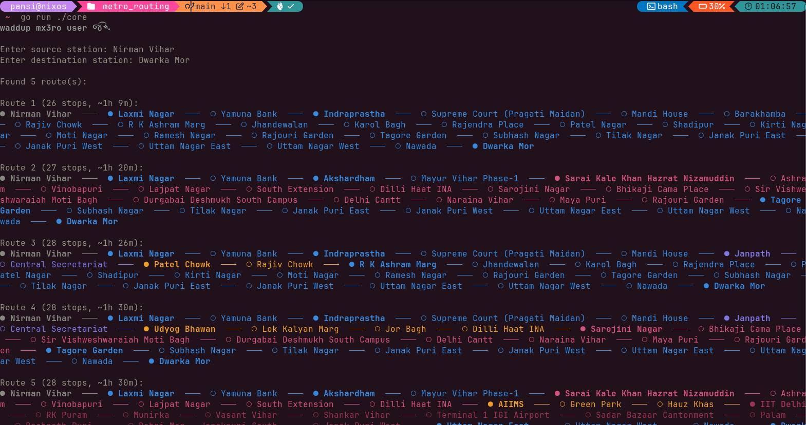
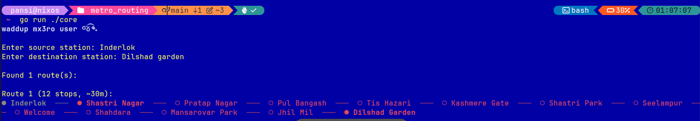
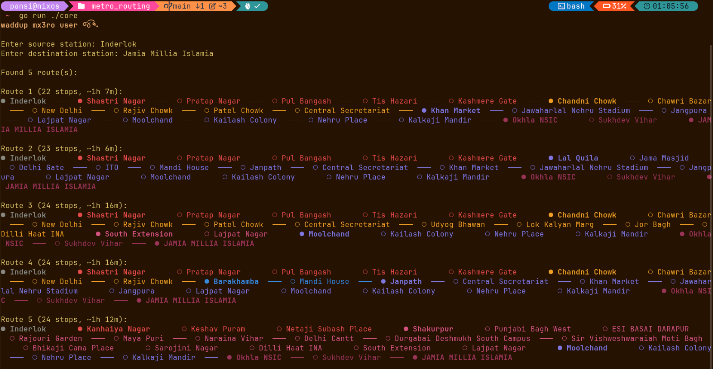

# mx3ro
> THIS IS NOT CURRENTLY EXECUTABLE ON INDIVIDUAL PC RATHER A DEMONSTRATION IF YOU DESIRE TO RUN IT YOU CAN CLONE IT BY CONVENTION BUT VERY SOON I'LL TRY TO PACKAGE AND MAKE IT AVAILABLE FOR ALL SYSTEMS

> ⚠️ This project needs CGO so be familiar with makefiles and building your system if you use arch or nix or independent systems make sure to be able to use that.

A project oriented on learning the concepts of backtracking through go that was made with the purpose of getting hands on with practical implementation of taking the user's typed-in source-destination and matching them case-insensitively against actual station names, then running two search algorithms: 
1. a fast BFS to find the shortest possible route as a baseline,
2. and a DFS-with-backtracking search capped near that baseline length to also surface a handful of close alternative routes, sorted shortest-first and trimmed to the top few.
I also calculated the time for each route with the help of

$$
\text{time} = (\text{number of stops} \times \text{average minutes per stop}) + (\text{number of interchanges} \times \text{interchange penalty})
$$

where average minutes per stop was 2.5 and interchange penalty 4, both units in minutes, and keeping speed 33kmph. While choosing 2.5 minute a distance time also considering the project is static is not a satisfactory option but i do plan to use latitude and longitude not as an arbitrary node rather to calculate the distances between 2 stations and further get haversine distance alongside to get the ETA. 

Below i have attached some references to see: 

## Route 1

## Route 2

## Route 3

Data Cleaning is also a significant part of the project but what it did is stripping messy tags out of station names, fixing the spelling inconsistency in one line's name (violet from voilet). Stations on the same line, sorted by distance, become "connected" to their immediate neighbours. Stations that share the same name but appear under different lines become "interchange" connections and for ui lipgloss did the work and muesli helped in fixing the inconsistent discolouration pretty common in xterm256 standard.
> ● **represents** source, destination, and any interchange stops

> ○ **represents** ordinary stations in between
